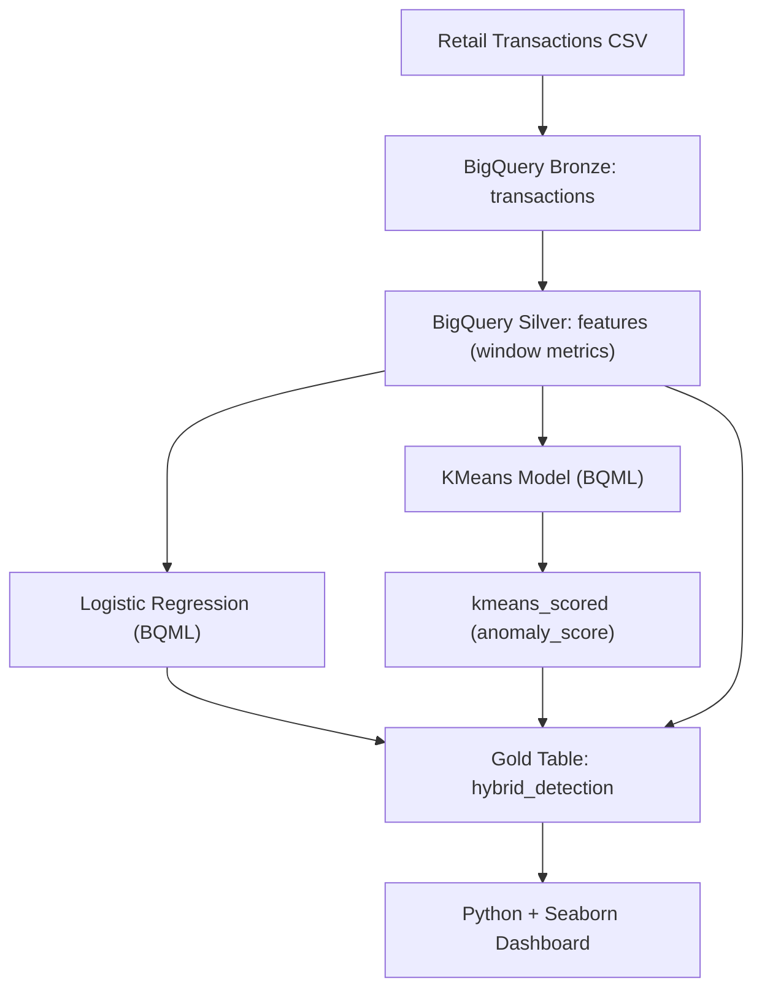

# 🛡️ RetailGuard: Hybrid Fraud & Defect Detection with BigQuery ML

---

## 📌 Executive Summary

Large-scale retail operations face two persistent risks:

- **Return Fraud** that erodes margins through coordinated abuse
- **Product Defects** that trigger costly return waves and damage customer trust

**RetailGuard** is a cloud-native machine learning system built on **Google BigQuery ML** that detects both problems using a hybrid analytical approach combining:

- Supervised fraud detection  
- Unsupervised anomaly discovery  
- Behavioral feature engineering  
- Operational analytics visualization  

The system analyzes **120,000 retail transactions** and automatically surfaces high-risk patterns without requiring complex infrastructure or data movement outside BigQuery.

---

## 🎯 Business Problems Addressed

### Return Fraud
- Artificially elevated return rates
- Suspicious clustering by product and store
- Inflated transaction values to maximize refunds
- Coordinated behavioral abuse patterns

### Mass Defect Events
- Sudden spikes in **Damaged** returns
- Isolated product failures
- Short detection windows
- Price suppression caused by clearance reactions

Traditional rule-based monitoring struggles with evolving fraud behavior — this project demonstrates how ML-driven analytics can adapt automatically.

---

## 🧠 Modeling Strategy

RetailGuard uses a **Hybrid ML Architecture**.

### Supervised Learning — Logistic Regression
Detects known fraud patterns using labeled transactions.

Outputs:
- Fraud probability score (`fraud_prob`)
- Interpretable behavioral signals

### Unsupervised Learning — KMeans Clustering
Detects unknown or emerging anomalies by measuring distance from normal purchasing behavior.

Outputs:
- `anomaly_score` (centroid distance)
- Behavioral outliers not present in training labels

### Hybrid Risk Layer (Gold Table)

Both models are merged into a single analytical dataset:

| Scenario | Detection Method |
|---|---|
| Known refund abuse | Logistic Regression |
| Emerging fraud tactics | KMeans anomaly scoring |
| Product quality failures | Time-series defect analysis |

---

## 🏗️ Architecture Overview

## 🏗️ Data Layers
- **Bronze:** Raw transactions  
- **Silver:** Engineered behavioral features  
- **Gold:** Hybrid ML predictions + anomaly scores  

All ML training occurs directly inside BigQuery.

---

## ⚙️ Technical Workflow

### Data Engineering
- Loaded transaction logs into BigQuery  
- Preserved product, store, and return metadata  

### Feature Engineering
- Rolling 30-day transaction counts  
- Return frequency signals  
- Average price behavior  

### Model Training
- Logistic Regression for supervised fraud prediction  
- KMeans clustering for anomaly detection  

### Anomaly Detection
- `ML.PREDICT` for distance-based anomaly scoring  
- `ML.DETECT_ANOMALIES` for automated outlier labeling  

### Hybrid Risk Scoring
- Combined supervised + unsupervised signals  
- Generated investigation-ready risk labels  

---

## 📊 Key Insights & Business Impact

### Fraud Detection
- Clear separation between normal and fraudulent behavior  
- High-risk clusters localized to specific stores and categories  

### Product Defect Discovery
- Automated detection of damaged-return spikes  
- Identified clearance-price patterns linked to defective inventory  

### Operational Benefits
- Reduced manual investigation workload  
- Faster supply chain response to defective batches  
- Scalable SQL-first architecture  

---

## 📈 Example Analytical Outputs

- Fraud probability distributions  
- Anomaly score tail analysis  
- Hybrid risk quadrant visualization  
- Store × Category risk heatmap  
- Defect spike time-series monitoring  

*(All charts generated via Python + Seaborn from the Gold table.)*

---

## 🧰 Technical Stack

| Component | Technology |
|---|---|
| Cloud Platform | Google Cloud Platform |
| Data Warehouse | BigQuery |
| ML Engine | BigQuery ML |
| Models | Logistic Regression + KMeans |
| Visualization | Python (Seaborn, Matplotlib) |
| Languages | SQL, Python |
| Dataset | 120k synthetic retail transactions |

---

## 🚀 Impact for Retailers

This architecture can evolve into a reusable monitoring system capable of:

- Flagging high-risk returns automatically  
- Detecting defective product batches early  
- Reducing financial loss (“shrinkage”)  
- Enabling targeted store audits instead of blanket investigations  

---

## 🔮 Future Improvements

- Gradient Boosted Trees for nonlinear fraud patterns  
- ARIMA forecasting for automated defect alerts  
- Streaming detection using Pub/Sub  
- Active learning loop with analyst feedback  

---

## ⭐ Why This Project Matters

RetailGuard demonstrates practical Data Science beyond model training:

- SQL-based feature engineering  
- Hybrid supervised + unsupervised ML  
- Cloud-native analytics architecture  
- Risk modeling translated into business decisions  
- End-to-end reproducible pipeline
